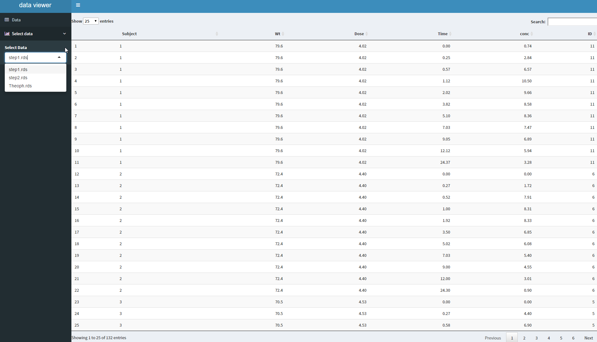

README
=========

```
view2 <- PKPDmisc::view_creator("<path/to/dataviewer>")

## for example
view2 <- PKPDmisc::view_creator("~/Repos/dataviewer")
```

To then save data it is as simple as calling `view2`, and the resulting rds file
created in the dataviewer folder will take the name of the data.

```
view2(Theoph)
```

You can use `view2` in your data pipelines. However, because the data is 
represented as a `.` in the pipeline, it should be given a name. Luckily, the view_creator
also creates a parameter `name` that allows the name of the resulting rds file
to be customized.


```
library(dplyr)
Theoph %>% summarize(cmax = max(conc)) %>% view2(name = "Theoph")
```

it can also be used multiple times, as it will return the data that is piped in and
pass it along the pipeline by default, so can see what intermediate outputs are


```
Theoph %>% mutate(ID = as.numeric(Subject)) %>% view2("step1") %>%
    mutate(ID2 = as.numeric(as.character(Subject))) %>% view2("step2")
```



